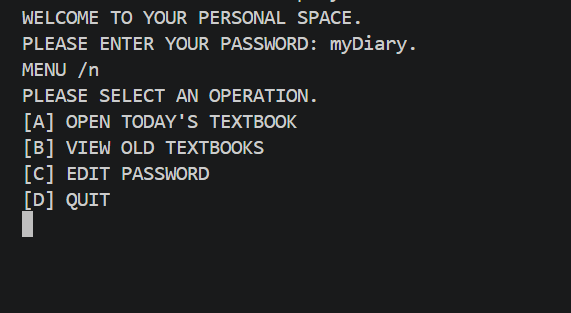

# diary.py
A TERMINAL BASED DIARY LIKE PROJECT THAT SAVES ENTRIES AUTOMATICALLY.

## FEATURES
- PASSWORD PROTECTED LOG-IN SYSTEM
- GENERATING FILE NAME USING DATE
- TEXT INPUT LOOP WITH CUSTOM EXIT COMMAND
- HISTORICAL ENTRY RETRIEVAL SYSTEM

## INTRODUCTION
- NO NEED TO DOWNLOAD ANY MODULES BECAUSE IT JUST HAS BUILD-IN PYTHON MODULE
- CONTROL YOUR PYTHON VERSION WITH 'python -v' FROM TERMINAL
- GO TO THE PATH THAT YOUR FILE IS IN
- WRITE 'python diary.py' TO RUN
- IT WANTS A PASSWORD 'password = myDiary.'

## MENU OPTIONS
- USE 'A' COMMAND TO WRITE TODAY'S PAGES
- USE 'B' COMMEND TO READ SPECIFIC DATE'S PAGES (DATE FORMAT EXACTLY NEEDS TO BE YYYY-MM-DD)
- USE 'C' COMMEND TO CHANGE YOUR PASSWORD 
- USE 'D' COMMEND TO QUIT FROM PROGRAM AND RETURN TO THE TERMINAL
